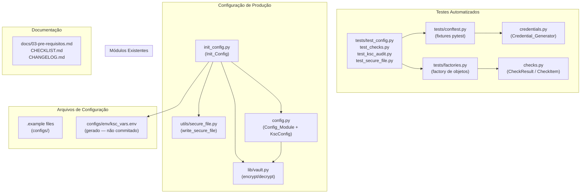

# Design Document — credential-sanitization

## Overview

Este documento descreve o design técnico para a feature **credential-sanitization**, cujo
objetivo é eliminar todas as credenciais fixas com aparência realista do repositório
`ksc-deployment-runbook`, substituindo-as por dois mecanismos complementares:

1. **Geração sintética em testes**: módulo `credentials.py` + fixtures pytest produzem
   credenciais aleatórias criptograficamente seguras em tempo de execução. Nenhuma string
   sensível é persistida no repositório.
2. **Configuração interativa de produção**: script `init_config.py` guia o operador no
   preenchimento seguro de variáveis de ambiente, escrevendo o arquivo com permissões
   estritas (`0o600`) e nunca exibindo ou logando senhas.

O escopo se restringe estritamente aos arquivos listados nos requisitos. Nenhum diretório
novo será criado.

### Motivação

O repositório continha strings fixas em arquivos de teste e em configurações de exemplo
que o `detect-secrets` classifica como segredos (senhas com alta entropia, hostnames com
TLDs reais). Isso representa risco de vazamento acidental, bloqueia pipelines de segurança
(pre-commit hooks, Aikido, CodeQL) e é uma má prática de engenharia. A solução escolhida
usa geração aleatória via `secrets` (stdlib) para testes e um fluxo interativo seguro para
produção, sem nenhuma dependência externa nova nos módulos principais.

---

## Architecture

O diagrama abaixo mostra como os novos módulos se relacionam com os existentes:



### Princípios de Design

- **Zero dependências externas novas** nos módulos de geração e configuração (somente
  stdlib: `secrets`, `string`, `uuid`, `argparse`, `getpass`, `pathlib`, `difflib`).
- **Escrita atômica** de todos os arquivos sensíveis via `write_secure_file` (temp +
  `os.replace`) com permissões `0o600`.
- **Isolamento de escopo** nos testes via fixture de escopo `function`: cada teste recebe
  credenciais únicas e nunca compartilha estado global.
- **Sem credenciais no repositório**: nem em código, nem em exemplos, nem em arquivos de
  configuração commitados.

---

## Components and Interfaces

### 1. `automation/python/credentials.py` — Credential_Generator

Módulo novo. Usa exclusivamente stdlib (`secrets`, `string`, `uuid`).

```python
def generate_password(length: int = 24, *, include_symbols: bool = True) -> str:
    """Retorna string de exatamente `length` chars, criptograficamente segura.
    Raises ValueError se length < 8 ou > 256."""

def generate_hostile_password(length: int = 24) -> str:
    """Retorna senha com pelo menos um char de cada conjunto:
    "'", " ", ";", "&", "$(". Garante todos os 5 conjuntos por construção."""

def generate_synthetic_fqdn() -> str:
    """Retorna FQDN no formato ksc-{hex8}.test."""

def generate_username(prefix: str = "testuser") -> str:
    """Retorna string no formato {prefix}_{hex6}."""

def generate_test_db_name(prefix: str = "ksctest") -> str:
    """Retorna string no formato {prefix}_{hex6}."""
```

**Estratégia de implementação de `generate_hostile_password`**: a função garante os 5
conjuntos obrigatórios por construção — insere um caractere de cada conjunto numa lista
base, preenche o restante aleatoriamente e embaralha com `secrets.SystemRandom().shuffle`.
Isso garante que o invariante seja satisfeito em 100% das chamadas sem rejeição-resampling.

**Estratégia de `generate_password` com `include_symbols=False`**: usa
`string.ascii_letters + string.digits` como alphabet. Com `include_symbols=True`, adiciona
`string.punctuation`.

### 2. `tests/conftest.py` — Fixtures Pytest

Arquivo novo (ou criado do zero se não existir). Importa apenas `credentials.py`,
`KscConfig` e `write_secure_file`.

```python
@pytest.fixture
def random_password() -> str: ...

@pytest.fixture
def hostile_password() -> str: ...

@pytest.fixture
def ksc_test_config() -> KscConfig:
    """KscConfig com db_host="127.0.0.1", db_port=5432, e campos
    sensíveis gerados sinteticamente."""

@pytest.fixture
def ksc_test_env_file(tmp_path) -> pathlib.Path:
    """Cria .env sintético em tmp_path com permissão 0o600.
    Contém: KSC_DB_HOST, KSC_DB_PORT, KSC_IAM_NAME, KSC_DB_USER,
    KSC_DB_PASS, KSC_ADMIN_PASS, KSC_WEB_PORT."""
```

### 3. `tests/factories.py` — Factory de Objetos de Teste

Arquivo novo. Importa apenas `CheckResult` e `CheckItem`.

```python
def make_check_item(name: str, status: str = "ok", message: str = "") -> CheckItem: ...
def make_check_result(items: list | None = None) -> CheckResult: ...
def make_critical_result(name: str = "test_crit", message: str = "Falha de teste") -> CheckResult: ...
```

### 4. `automation/python/init_config.py` — Init_Config

Script novo. Executável via `python3 -m automation.python.init_config`.

**Fluxo principal:**

```mermaid
flowchart TD
    A[Início] --> B{ksc_vars.env existe?}
    B -- Sim --> C[Exibe diff das chaves\nsem mostrar valores sensíveis]
    C --> D{Operador confirma s/N?}
    D -- Não --> Z[Encerra sem escrever]
    B -- Não --> E[Coleta campos não-sensíveis\nvia input com padrão]
    D -- Sim --> E
    E --> F[Coleta campos sensíveis\nvia getpass]
    F --> G{Validação via Config_Module}
    G -- Falha --> H[Exibe "Valor inválido:"\nrepete o campo]
    H --> E
    G -- OK --> I[write_secure_file 0o600\nescrita atômica]
    I --> J{Flag --vault?}
    J -- Sim --> K[vault.encrypt_secrets\ngrava configs/secrets.bin 0o600]
    J -- Não --> L[Sucesso]
    K --> L
```

**Campos não-sensíveis** (coletados via `input()`):
`KSC_DB_HOST`, `KSC_DB_PORT`, `KSC_DB_USER`, `KSC_FQDN`, `KSC_HOST`, `KSC_USER`,
`KSC_WEB_PORT`, `KSC_SELINUX_MODE`.

**Campos sensíveis** (coletados via `getpass.getpass()`):
`KSC_DB_PASS`, `KSC_ADMIN_PASS`, `KSC_PASS`.

**Tratamento de falha de I/O**: usa `tempfile.mkstemp` + `os.replace` para escrita
atômica — se o rename falhar, o arquivo temporário é removido e o script encerra com
código `1`, sem arquivo parcial em disco.

### 5. `automation/python/config.py` — Ajustes no Config_Module

Mudanças delta sobre o módulo existente:

- **`validate_fqdn`**: o validador existente já aplica regex; este requisito formaliza o
  contrato. O default `"kscserver.exemplo.ts.net"` deve ser substituído por
  `"ksc-placeholder.test"` (FQDN sintético não-realista) para eliminar o hostname com TLD
  real do código-fonte.
- **`db_sslmode`**: já usa `Literal[...]` com os valores corretos via pydantic — sem
  mudança de lógica, apenas documentação do contrato.
- **Suporte a vault em `load_config()`**: após carregar o `.env`, verifica se
  `configs/secrets.bin` existe; se sim, chama `vault.decrypt_secrets()` e mescla os
  valores retornados sobre o dict de configuração, dando precedência ao vault. Se a
  decifragem lançar qualquer exceção, loga `WARNING` e continua com valores do `.env`.

```python
# Pseudocódigo do delta em load_config():
env_values = _load_dotenv_to_dict(env_path)

secrets_path = "configs/secrets.bin"
if os.path.exists(secrets_path):
    try:
        vault_values = vault.decrypt_secrets()
        env_values.update(vault_values)   # vault tem precedência
    except Exception as exc:
        logging.warning("Vault decrypt falhou, usando .env: %s", exc)

# construção do KscConfig a partir de env_values...
```

### 6. Arquivos `.example` — Sanitização

- `configs/examples/ksc.env.example`: substituir hostnames com TLD real e qualquer valor
  classificável como segredo por `<PREENCHER: instrução>`. O arquivo atual não possui
  senhas hardcoded, mas `KSC_HOSTNAME=kscserver.portosoft.local` usa TLD `.local` realista
  e deve virar `<PREENCHER: hostname ou IP do servidor KSC>`.
- `configs/env/ksc_vars.env.example` (arquivo novo): template com todas as variáveis
  necessárias para `init_config.py` e `load_config()`, cada uma com marcador
  `<PREENCHER: ...>`. Inclui `KSC_DB_PASS=<PREENCHER: gerar com openssl rand -base64 24>`.

### 7. Migração dos Testes Existentes

| Arquivo | Credenciais a substituir | Mecanismo de substituição |
|---|---|---|
| `test_config.py` | `"unittest-dummy-db-pass-000"`, `"unittest-dummy-admin-pass-999"` | `generate_password()` injetado via `monkeypatch.setenv` ou `patch.dict` |
| `test_checks.py` | `db_password="123"`, `ksc_admin_password="123"` em `dummy_config` | fixture `ksc_test_config` do conftest |
| `test_ksc_audit.py` | Nenhum direto (usa MagicMock) — revisar para confirmar |
| `test_secure_file.py` | `"my secret content"`, `"temporary secret"` | strings neutras sem aparência de credencial ou wrapped em generate_password() |

Todos os comentários `# pragma: allowlist secret` serão removidos.

---

## Data Models

### `KscConfig` (existente, pequena alteração)

```python
class KscConfig(BaseModel):
    db_host: str = "127.0.0.1"
    db_port: int = Field(default=5432, ge=1, le=65535)
    db_name: str = "ksciam"
    db_user: str = "kluser"
    db_password: str                           # obrigatório, sem default
    db_sslmode: Literal[
        "disable", "prefer", "require", "verify-ca", "verify-full"
    ] = "prefer"
    ksc_admin_password: str                    # obrigatório, sem default
    ksc_license_path: Optional[str] = None
    web_port: int = Field(default=443, ge=1, le=65535)
    selinux_expected_mode: str = "enforcing"
    ksc_host: str = "127.0.0.1"
    ksc_user: str = "suporte"
    ksc_pass: Optional[str] = None
    ksc_fqdn: str = "ksc-placeholder.test"    # alterado: sem TLD realista
    ksc_admin_user: str = "KLAdmins"
```

### Credenciais Sintéticas (geradas, nunca persistidas)

```python
# Exemplos de valores gerados em tempo de execução:
password: str        # ex: "xK3#mP9@vL2!qR7&nT0^"   (length=24, include_symbols=True)
hostile_pwd: str     # ex: "aB'c &d;e$(fghi"          (contém os 5 conjuntos obrigatórios)
fqdn: str            # ex: "ksc-4f3a1b2c.test"         (formato fixo, TLD .test)
username: str        # ex: "testuser_a1b2c3"           (formato fixo)
db_name: str         # ex: "ksctest_d4e5f6"            (formato fixo)
```

### Env File Layout (`ksc_vars.env.example`)

```
KSC_DB_HOST=<PREENCHER: IP ou hostname do servidor PostgreSQL>
KSC_DB_PORT=<PREENCHER: porta do PostgreSQL, padrão 5432>
KSC_DB_USER=<PREENCHER: usuário do banco de dados>
KSC_DB_PASS=<PREENCHER: gerar com openssl rand -base64 24>
KSC_ADMIN_PASS=<PREENCHER: senha do administrador KSC>
KSC_FQDN=<PREENCHER: FQDN do servidor KSC>
KSC_HOST=<PREENCHER: IP ou hostname do servidor KSC>
KSC_USER=<PREENCHER: usuário SSH/sudo no servidor>
KSC_PASS=<PREENCHER: senha SSH (ou deixar vazio se usar chave)>
KSC_WEB_PORT=<PREENCHER: porta do Web Console, padrão 443>
KSC_SELINUX_MODE=<PREENCHER: modo SELinux esperado, ex: enforcing>
```

---

## Correctness Properties

*A property is a characteristic or behavior that should hold true across all valid
executions of a system — essentially, a formal statement about what the system should do.
Properties serve as the bridge between human-readable specifications and machine-verifiable
correctness guarantees.*

### Property 1: `generate_password` retorna string de comprimento exato

*For any* integer `n` in the range [8, 256], calling `generate_password(n)` shall return a
string whose length is exactly `n`.

**Validates: Requirements 1.1**

---

### Property 2: `generate_password` com `include_symbols=False` retorna apenas alfanuméricos

*For any* integer `n` in [8, 256], calling `generate_password(n, include_symbols=False)`
shall return a string where every character belongs to `string.ascii_letters +
string.digits`, with no symbols or whitespace.

**Validates: Requirements 1.8**

---

### Property 3: `generate_password` com comprimento inválido lança `ValueError`

*For any* integer `n` where `n < 8` or `n > 256`, calling `generate_password(n)` shall
raise `ValueError` with a message matching `"length deve estar entre 8 e 256, recebido: {n}"`.

**Validates: Requirements 1.9**

---

### Property 4: `generate_hostile_password` sempre contém todos os cinco conjuntos obrigatórios

*For any* call to `generate_hostile_password()`, the returned string shall contain at least
one character from each of the following five sets: the single quote character (`'`), a
space (` `), a semicolon (`;`), an ampersand (`&`), and the literal two-character sequence
`$(`.

**Validates: Requirements 1.2**

---

### Property 5: `generate_synthetic_fqdn` sempre respeita o formato `ksc-{hex8}.test`

*For any* call to `generate_synthetic_fqdn()`, the returned string shall match the regular
expression `^ksc-[0-9a-f]{8}\.test$`.

**Validates: Requirements 1.3**

---

### Property 6: `generate_username` e `generate_test_db_name` respeitam seus formatos

*For any* non-empty prefix string `p`:
- `generate_username(p)` shall return a string matching `^{p}_[0-9a-f]{6}$`.
- `generate_test_db_name(p)` shall return a string matching `^{p}_[0-9a-f]{6}$`.

**Validates: Requirements 1.4, 1.5**

---

### Property 7: Unicidade probabilística das funções geradoras

*For any* generator function `f` in `{generate_password, generate_hostile_password,
generate_synthetic_fqdn, generate_username, generate_test_db_name}`, collecting 1000
consecutive return values of `f()` shall yield a set with at least 999 distinct elements.

**Validates: Requirements 1.6**

---

### Property 8: Validação FQDN — valores inválidos sempre rejeitados

*For any* string `s` that does NOT satisfy at least one of: (a) simple hostname with ≤ 63
alphanumeric/hyphen characters, not starting or ending with a hyphen; (b) FQDN with each
label ≤ 63 characters and total length ≤ 253; (c) IPv4 address with each octet in [0, 255]
— attempting to construct `KscConfig(ksc_fqdn=s, ...)` shall raise a `ValidationError` or
`ConfigError`.

**Validates: Requirements 6.1**

---

### Property 9: Validação `db_sslmode` — valores fora do conjunto sempre rejeitados

*For any* string `s` not in `{"disable", "prefer", "require", "verify-ca", "verify-full"}`,
attempting to construct `KscConfig(db_sslmode=s, ...)` shall raise a `ValidationError`.

**Validates: Requirements 6.2**

---

### Property 10: `make_check_item` e `make_critical_result` preservam os parâmetros fornecidos

*For any* strings `name`, `status`, and `message`:
- `make_check_item(name, status, message).name == name`, `.status == status`, `.message == message`.
- `make_critical_result(name, message)` returns a `CheckResult` with exactly one item
  where `.name == name`, `.status == "critical"`, `.message == message`.

**Validates: Requirements 3.1, 3.3**

---

## Error Handling

### `credentials.py`

| Situação | Comportamento |
|---|---|
| `length < 8` ou `length > 256` | `ValueError` com mensagem `"length deve estar entre 8 e 256, recebido: {length}"` |
| Falha no `secrets.choice` (improvável) | Propaga `RuntimeError` nativo |

### `init_config.py`

| Situação | Comportamento |
|---|---|
| Valor de campo falha validação do Config_Module | Exibe `"Valor inválido: {msg}"` e repete o prompt do mesmo campo em loop |
| `IOError` ao escrever `ksc_vars.env` | Exibe mensagem de erro do SO, remove arquivo temporário (se existir), encerra com `sys.exit(1)` |
| Operador não confirma sobrescrita (`!= "s"/"S"`) | Encerra sem escrever (exit code 0) |
| Vault encrypt falha | Propaga exceção; arquivo `.env` já foi escrito com sucesso antes desta etapa |

### `config.py` — `load_config()`

| Situação | Comportamento |
|---|---|
| Arquivo `.env` não existe | `ConfigError("Arquivo de ambiente não encontrado: {path}")` |
| `KSC_DB_PASS` ausente ou vazia | `ConfigError("KSC_DB_PASS é obrigatória")` |
| `KSC_ADMIN_PASS` ausente ou vazia | `ConfigError("KSC_ADMIN_PASS é obrigatória")` |
| Falha de validação pydantic | `ConfigError("Erro de validação nas configurações: {detalhes}")` |
| `vault.decrypt_secrets()` lança exceção | `logging.warning(...)` + continua com valores do `.env` |

### `tests/conftest.py`

As fixtures não devem lançar exceções em uso normal. Falhas de I/O em `write_secure_file`
dentro da fixture `ksc_test_env_file` propagarão como erro de setup do teste (pytest
reporta como `ERROR`, não `FAILED`).

---

## Testing Strategy

### Abordagem Dual: Testes de Exemplo + Testes Baseados em Propriedades

A suíte combina testes de exemplo (para comportamentos específicos e cenários de erro) com
testes baseados em propriedades (para invariantes universais), usando **pytest** +
**Hypothesis** como biblioteca de PBT.

**Biblioteca escolhida**: [Hypothesis](https://hypothesis.readthedocs.io/) — padrão de
facto para PBT em Python, disponível via `pip install hypothesis`. Deve ser adicionada ao
`requirements.txt`.

**Configuração mínima**: cada teste de propriedade é configurado com
`@settings(max_examples=100)` no mínimo. Cada teste deve referenciar a propriedade de
design correspondente em um comentário no formato:
`# Feature: credential-sanitization, Property N: <texto resumido>`.

---

### Testes de Propriedade (Hypothesis)

Os testes de propriedade implementam as Properties 1–10 do design:

**`tests/test_credentials.py`** (arquivo novo):

```python
# Feature: credential-sanitization, Property 1: generate_password retorna comprimento exato
@given(st.integers(min_value=8, max_value=256))
@settings(max_examples=200)
def test_password_length(length):
    assert len(generate_password(length)) == length

# Feature: credential-sanitization, Property 2: include_symbols=False retorna apenas alfanuméricos
@given(st.integers(min_value=8, max_value=256))
@settings(max_examples=200)
def test_password_no_symbols(length):
    pwd = generate_password(length, include_symbols=False)
    allowed = set(string.ascii_letters + string.digits)
    assert all(c in allowed for c in pwd)

# Feature: credential-sanitization, Property 3: length inválido lança ValueError
@given(st.one_of(st.integers(max_value=7), st.integers(min_value=257)))
@settings(max_examples=100)
def test_password_invalid_length(length):
    with pytest.raises(ValueError, match="length deve estar entre 8 e 256"):
        generate_password(length)

# Feature: credential-sanitization, Property 4: hostile_password contém todos os 5 conjuntos
@settings(max_examples=500)
def test_hostile_password_contains_all_sets():
    pwd = generate_hostile_password()
    assert "'" in pwd
    assert " " in pwd
    assert ";" in pwd
    assert "&" in pwd
    assert "$(" in pwd

# Feature: credential-sanitization, Property 5: generate_synthetic_fqdn formato ksc-{hex8}.test
@settings(max_examples=200)
def test_synthetic_fqdn_format():
    fqdn = generate_synthetic_fqdn()
    assert re.fullmatch(r"ksc-[0-9a-f]{8}\.test", fqdn)

# Feature: credential-sanitization, Property 6: generate_username e generate_test_db_name
@given(st.text(min_size=1, max_size=20, alphabet=st.characters(whitelist_categories=("Lu","Ll","Nd"))))
@settings(max_examples=100)
def test_username_format(prefix):
    result = generate_username(prefix)
    assert re.fullmatch(rf"{re.escape(prefix)}_[0-9a-f]{{6}}", result)

# Feature: credential-sanitization, Property 7: unicidade probabilística
@settings(max_examples=1)
def test_uniqueness_generate_password():
    results = [generate_password() for _ in range(1000)]
    assert len(set(results)) >= 999
```

**`tests/test_credentials_properties.py`** (propriedades 8–10):

```python
# Feature: credential-sanitization, Property 8: FQDN inválido rejeitado
@given(st.text().filter(lambda s: not _is_valid_fqdn(s)))
@settings(max_examples=100)
def test_invalid_fqdn_rejected(invalid_fqdn):
    with pytest.raises((ValidationError, ValueError)):
        KscConfig(db_password="x"*8, ksc_admin_password="x"*8, ksc_fqdn=invalid_fqdn)

# Feature: credential-sanitization, Property 9: db_sslmode inválido rejeitado
VALID_SSLMODES = {"disable", "prefer", "require", "verify-ca", "verify-full"}
@given(st.text().filter(lambda s: s not in VALID_SSLMODES))
@settings(max_examples=100)
def test_invalid_sslmode_rejected(invalid_mode):
    with pytest.raises((ValidationError, ValueError)):
        KscConfig(db_password="x"*8, ksc_admin_password="x"*8, db_sslmode=invalid_mode)

# Feature: credential-sanitization, Property 10: make_check_item e make_critical_result
@given(st.text(), st.text(), st.text())
@settings(max_examples=200)
def test_make_check_item_preserves_params(name, status, message):
    item = make_check_item(name, status, message)
    assert item.name == name
    assert item.status == status
    assert item.message == message
```

---

### Testes de Exemplo e Integração

**`tests/test_credentials.py`** (exemplos adicionais):
- `test_password_default_length`: `len(generate_password()) == 24`
- `test_username_default_prefix`: resultado começa com `"testuser_"`
- `test_db_name_default_prefix`: resultado começa com `"ksctest_"`

**`tests/test_config.py`** (migrado):
- Remove todos os `# pragma: allowlist secret`
- Substitui strings hardcoded por `generate_password()` via `patch.dict(os.environ, ...)`
- Mantém todos os nomes de função existentes

**`tests/test_checks.py`** (migrado):
- `dummy_config` fixture substituída por `ksc_test_config` do conftest
- Remove `db_password="123"` e equivalentes

**Smoke Tests** (executados em CI via `pytest -m smoke`):
- Verificação de que `detect-secrets scan --no-baseline tests/` retorna zero findings
- Verificação de que `detect-secrets scan --no-baseline configs/` retorna zero findings

---

### Cobertura Esperada

| Componente | Tipo de Teste | Arquivo |
|---|---|---|
| `credentials.py` — funções geradoras | Propriedade + Exemplo | `test_credentials.py` |
| `config.py` — validação FQDN/sslmode | Propriedade | `test_credentials_properties.py` |
| `config.py` — load_config + vault | Exemplo | `test_config.py` |
| `checks.py` — factories | Propriedade + Exemplo | `test_credentials_properties.py` |
| `init_config.py` | Exemplo (mock stdin) | `test_init_config.py` |
| `secure_file.py` | Exemplo | `test_secure_file.py` |
| `conftest.py` fixtures | Exemplo (fixture smoke) | `test_conftest.py` |
