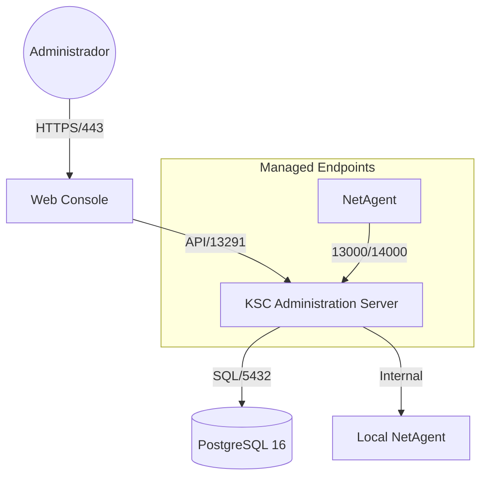

# 01 - Visão Geral

## Objetivo
Fornecer o contexto técnico necessário para entender como os componentes do KSC interagem com o sistema operacional e o banco de dados.

## Arquitetura Logística
O KSC no Linux é composto por:
- **klserver**: O serviço principal (Administration Server).
- **klnagent**: Agente de rede local para gerenciamento do próprio host.
- **klwebsrv**: Servidor do Console Web.
- **PostgreSQL**: Backend de armazenamento de dados.

## Fluxo de Dados
1. O Administrador acessa o Web Console (Porta 443).
2. O Web Console comunica-se com o Administration Server (Porta 13291).
3. O Administration Server lê/escreve no PostgreSQL (Porta 5432).
4. Dispositivos gerenciados comunicam-se com o Server (Portas 13000/14000).

---
[Próximo Passo: Matriz de Compatibilidade >>](02-matriz-compatibilidade.md)
