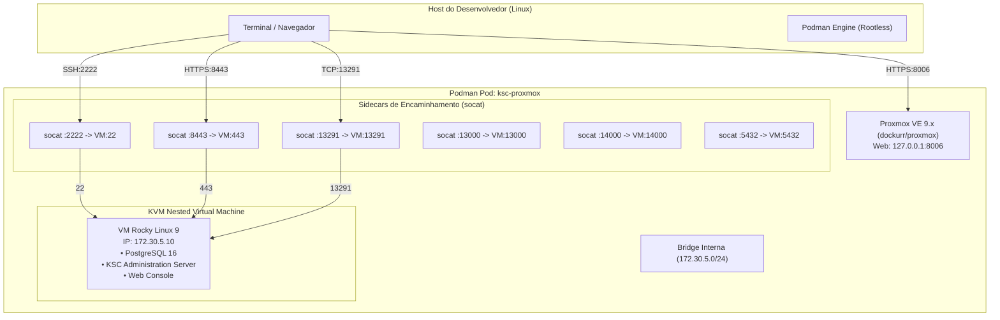

# 14 - Ambiente de Testes Proxmox Local (dockur/proxmox)

## 🎯 Objetivo
Fornecer um laboratório local isolado e reproduzível utilizando virtualização aninhada via **Proxmox VE containerizado** ([dockur/proxmox](https://github.com/dockur/proxmox)), permitindo testar ponta a ponta o ciclo de vida de deploy, hardening, auditoria e rollback do KSC 16.x em uma máquina virtual limpa com **Rocky Linux 9**.

---

## 🏗️ Topologia da Infraestrutura de Teste



---

## 📋 Pré-requisitos no Host

1. **Podman** 4.x ou 5.x configurado em modo rootless com runtime OCI `crun` (padrão no RHEL/Rocky/Debian/Ubuntu).
2. Suporte a **KVM** habilitado e permissões no dispositivo:
   ```bash
   ls -la /dev/kvm
   # Deve ter permissão de leitura/escrita para o seu usuário (ex: grupo kvm)
   sudo usermod -aG kvm $USER

   # Atualize a sessão ativa no shell para carregar o novo grupo (ou faça logout e login novamente):
   newgrp kvm
   ```
   > [!NOTE]
   > O container `proxmox` utiliza `group_add: ["keep-groups"]` no `compose.yml` para repassar os grupos suplementares do processo chamador (incluindo `kvm`) para dentro do container rootless. Por isso, a sessão ativa do shell que executa o `podman compose` deve conter o grupo `kvm` carregado e o Podman deve utilizar o runtime `crun` (`podman info --format '{{.Host.OCIRuntime.Name}}'`).
3. Suporte a virtualização aninhada no kernel:
   ```bash
   cat /sys/module/kvm_intel/parameters/nested # ou kvm_amd
   # Saída esperada: Y ou 1
   ```
4. Recursos mínimos no host:
   - **RAM Livre**: Mínimo 10 GB livres (8 GB para a VM + 2 GB para o Proxmox).
   - **Disco Livre**: Mínimo 120 GB livres para alocação do disco da VM.

---

## 🚀 Passo a Passo: Subindo o Proxmox

### 1. Criar o arquivo de variáveis fora do repositório
A senha de root do Proxmox e o IP alvo da VM ficam isolados em `~/.secrets/ksc-proxmox.env`:

```bash
mkdir -p ~/.secrets
install -m 600 /dev/null ~/.secrets/ksc-proxmox.env
printf 'PROXMOX_PASSWORD=%s\nKSC_VM_IP=172.30.5.10\n' "$(openssl rand -base64 24 | tr -d '/+=')" > ~/.secrets/ksc-proxmox.env
```

Para visualizar a senha gerada quando precisar logar na Web UI:
```bash
cat ~/.secrets/ksc-proxmox.env
```

### 2. Inicializar o ambiente via Podman Compose

Na raiz do repositório:
```bash
podman compose --env-file ~/.secrets/ksc-proxmox.env \
  -f infra/proxmox/compose.yml up -d
```

Acompanhe os logs da inicialização inicial do Proxmox:
```bash
podman logs -f ksc-proxmox
```

### 3. Acessar a Interface do Proxmox VE
- Abra o navegador em: **`https://127.0.0.1:8006/`**
- Usuário: `root`
- Senha: `<valor de PROXMOX_PASSWORD do env-file>`
- Realm: **Linux PAM standard authentication**

---

## 💻 Provisionando a VM Rocky Linux 9 de Testes

> [!IMPORTANT]
> O provisionamento é **automatizado**. A sequência manual pela interface web
> foi substituída por `infra/proxmox/provision-vm.sh`, que usa a imagem
> genericcloud do Rocky 9 com cloud-init. Passos manuais não são reproduzíveis
> e por isso não servem à validação E2E da issue #209.

```bash
./infra/proxmox/provision-vm.sh
```

O script executa, de ponta a ponta:

1. Gera o par de chaves SSH do laboratório em `~/.ssh/ksc-lab`, se ainda não existir.
2. Lê a sub-rede real da bridge `vmbr0` e recusa prosseguir se `KSC_VM_IP` estiver fora dela.
3. Baixa a imagem genericcloud do Rocky Linux 9 (aprox. 600 MB) para o nó.
4. Cria a VM `100` (`ksc-rocky9`): 4 vCPU, 16 GB de RAM, 120 GB de disco.
5. Importa o disco em **qcow2** e configura cloud-init (usuário `suporte`, IP estático, chave SSH).
6. Inicia a VM e aguarda o SSH responder em `127.0.0.1:2222`.
7. Cria o snapshot de linha de base `clean-baseline`.

Para recriar a VM do zero: `./infra/proxmox/provision-vm.sh --recreate`.

### Variáveis de ajuste

| Variável | Padrão | Observação |
| :--- | :--- | :--- |
| `KSC_VMID` | `100` | ID da VM no Proxmox |
| `KSC_VM_CORES` | `4` | vCPUs |
| `KSC_VM_MEMORY_MB` | `16384` | Abaixo de 16384 o `checks.py` emite aviso de RAM |
| `KSC_VM_DISK_GB` | `120` | O mínimo exigido pelos checks é 100 GB |
| `KSC_PVE_STORAGE` | `local` | Storage do nó |
| `KSC_VM_NET_MODEL` | `e1000` | Ver a nota sobre `vhost-net` abaixo |
| `KSC_ROCKY_VERSION` | `9.8` | Versão fixada da imagem; `latest` impediria reproduzir as evidências |
| `KSC_ROCKY_IMAGE_SHA256` | vazio | Preenchido, exige integridade da imagem baixada |

### Particularidades do ambiente containerizado

Verificadas em execução real (2026-09-12, Podman rootless 5.7.0):

- **Sub-rede da bridge.** A `vmbr0` recebe uma sub-rede escolhida dinamicamente
  — neste host, `172.30.6.0/24`, e não o `172.30.5.0/24` citado como exemplo.
  Ajuste `KSC_VM_IP` em `~/.secrets/ksc-proxmox.env` e suba a stack novamente
  para repontar os sidecars. O script aborta se houver divergência.
- **Formato do disco.** Em storage de diretório o padrão do `importdisk` é
  `raw`, que **não suporta snapshot** — e o snapshot de linha de base é
  requisito do roteiro. Por isso a importação usa `--format qcow2`.
- **Modelo de NIC.** Com `virtio`, o QEMU abre `/dev/vhost-net`, que sob Podman
  rootless chega ao container sem ACL e resulta em `Permission denied`, com a
  VM falhando ao iniciar. O padrão é `e1000`; a diferença de desempenho é
  irrelevante para o laboratório.
- **Nome do projeto compose.** O `compose.yml` fixa `name: ksc-lab`. Sem isso,
  o compose adota o nome do diretório (`proxmox`) e pode tentar recriar
  containers de outro laboratório homônimo no mesmo host.

---

## 📸 Snapshot de Linha de Base (Golden Snapshot)

O snapshot `clean-baseline` é criado automaticamente pelo `provision-vm.sh`
antes de qualquer execução do runbook.

```bash
# O VMID acompanha KSC_VMID (padrão 100); ajuste se tiver alterado a variável.
VMID="${KSC_VMID:-100}"

# Conferir
podman exec ksc-proxmox qm listsnapshot "$VMID"

# Restaurar a VM ao estado limpo entre ciclos de teste
podman exec ksc-proxmox qm rollback "$VMID" clean-baseline
podman exec ksc-proxmox qm start "$VMID"
```

> [!TIP]
> O `clean-baseline` é anterior ao download dos pacotes, então restaurá-lo
> descarta os RPMs (aprox. 420 MB, cerca de 25 minutos de download). Depois de
> preparar a VM com o repositório, as dependências e os pacotes já baixados e
> verificados, tire um segundo snapshot e use-o como ponto de partida dos
> ciclos de deploy:
>
> ```bash
> podman exec ksc-proxmox qm snapshot "${KSC_VMID:-100}" packages-ready \
>   --description "Repositório, dependências e RPMs verificados; antes do setup --apply"
> ```

---

## 🧪 Executando os Testes na VM

### 1. Conectar via SSH na VM
A porta `2222` do host é repassada diretamente para a porta `22` da VM:

```bash
ssh -i ~/.ssh/ksc-lab -p 2222 suporte@127.0.0.1
```

A chave é gerada pelo `provision-vm.sh` e instalada na VM via cloud-init.

### 2. Clonar e Configurar o Repositório dentro da VM

> [!WARNING]
> O `python3` do Rocky Linux 9 é a versão **3.9**, e o `requirements.txt` exige
> 3.10 ou superior (`md2pdf`). Instale e use o interpretador do AppStream —
> ver issue #231.

```bash
sudo dnf install -y git python3.11 python3.11-pip

git clone https://github.com/portosoft/ksc-deployment-runbook.git
cd ksc-deployment-runbook
python3.11 -m venv .venv
.venv/bin/python -m pip install -r requirements.txt

# Preparar o arquivo de variáveis de teste
cp configs/env/ksc_vars.env.example configs/env/ksc_vars.env
# Ajuste as variáveis (ou use init_config.py)
.venv/bin/python -m automation.python.init_config
```

> [!IMPORTANT]
> O ambiente virtual não é detalhe de estilo. Com `pip install --user`, as
> dependências ficam no diretório do operador e o `root` não as enxerga: os
> comandos que exigem privilégio falham com `ModuleNotFoundError`. Usar
> `.venv/bin/python` com e sem `sudo` garante o mesmo interpretador nos dois
> casos.

### 3. Executar o Ciclo de Testes Completo

```bash
# 1. Auditoria prévia de pré-requisitos
.venv/bin/python -m automation.python.kscctl audit --check

# 2. Obter e validar os pacotes oficiais (gate SHA-256 obrigatório)
.venv/bin/python -m automation.python.kscctl packages --download ksc-server-16.3-pt-BR        --output-dir /var/tmp/ksc_packages
.venv/bin/python -m automation.python.kscctl packages --download ksc-network-agent-16.3-pt-BR --output-dir /var/tmp/ksc_packages
.venv/bin/python -m automation.python.kscctl packages --download ksc-web-console-16.3-pt-BR   --output-dir /var/tmp/ksc_packages
.venv/bin/python -m automation.python.kscctl packages --verify-dir /var/tmp/ksc_packages

# 3. Simular a instalação completa sem alterar o sistema
.venv/bin/python -m automation.python.kscctl setup --check

# 4. Instalação e provisionamento reais — exigem privilégio
sudo .venv/bin/python -m automation.python.kscctl setup --apply

# 5. Hardening de banco de dados
sudo .venv/bin/python -m automation.python.kscctl db harden --apply

# 6. Auditoria pós-instalação
sudo .venv/bin/python -m automation.python.kscctl audit --postcheck

# 7. Geração do relatório de conformidade (Markdown + PDF)
sudo .venv/bin/python -m automation.python.kscctl audit --report
```

### 4. Validação Externa (a partir do Host do Desenvolvedor)
- **Web Console HTTPS:** Abra no navegador `https://127.0.0.1:8443`
- **PostgreSQL 16:** `psql -h 127.0.0.1 -p 5432 -U kluser -d ksc`
- **KSC API:** Verifique a porta `13291` com `nc -zv 127.0.0.1 13291`

---

## 🛑 Parando, Reiniciando e Limpando o Ambiente

> [!WARNING]
> **Reinício do Ambiente e Compartilhamento de Rede (`network_mode: "service:proxmox"`)**:
> Os sidecars `socat` compartilham o namespace de rede do container `proxmox`. Se o container `ksc-proxmox` for reiniciado isoladamente (por exemplo, via `podman restart ksc-proxmox`), os sidecars podem perder a conectividade de rede enquanto permanecem em estado *running*.
> **Sempre gerencie o ciclo de vida da stack inteira** via `podman compose`, utilizando `stop` seguido de `up -d` (ou `podman compose restart`), evitando reiniciar containers individuais diretamente pelo Podman.

Para pausar/parar todos os containers:
```bash
podman compose --env-file ~/.secrets/ksc-proxmox.env -f infra/proxmox/compose.yml stop
```

Para reiniciar a stack completa de forma segura:
```bash
podman compose --env-file ~/.secrets/ksc-proxmox.env -f infra/proxmox/compose.yml restart
```

Para destruir completamente o ambiente (mantendo os dados nos volumes):
```bash
podman compose --env-file ~/.secrets/ksc-proxmox.env -f infra/proxmox/compose.yml down
```

---
[<< Voltar ao Contrato Operacional](13-contrato-operacional.md) | [Ir para o Índice Principal](00-index.md)
