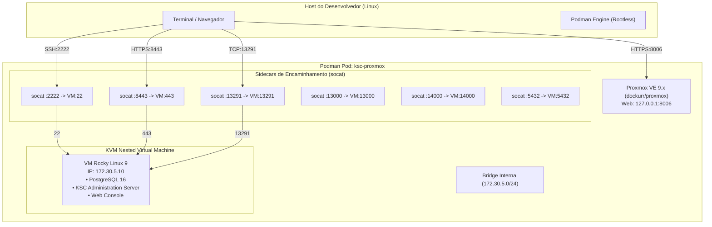

# 14 - Ambiente de Testes Proxmox Local (dockur/proxmox)

## 🎯 Objetivo
Fornecer um laboratório local isolado e reproduzível utilizando virtualização aninhada via **Proxmox VE containerizado** ([dockur/proxmox](https://github.com/dockur/proxmox)), permitindo testar ponta a ponta o ciclo de vida de deploy, hardening, auditoria e rollback do KSC 16.x em uma máquina virtual limpa com **Rocky Linux 9**.

---

## 🏗️ Topologia da Infraestrutura de Teste



---

## 📋 Pré-requisitos no Host

1. **Podman** 4.x ou 5.x configurado em modo rootless com runtime OCI `crun` (padrão no RHEL/Rocky/Debian/Ubuntu).
2. Suporte a **KVM** habilitado e permissões no dispositivo:
   ```bash
   ls -la /dev/kvm
   # Deve ter permissão de leitura/escrita para o seu usuário (ex: grupo kvm)
   sudo usermod -aG kvm $USER
   ```
   > [!NOTE]
   > O container `proxmox` utiliza `group_add: ["keep-groups"]` no `compose.yml` para repassar os grupos suplementares do usuário (incluindo `kvm`) para dentro do container rootless. Isso requer o runtime `crun` (`podman info --format '{{.Host.OCIRuntime.Name}}'`).
3. Suporte a virtualização aninhada no kernel:
   ```bash
   cat /sys/module/kvm_intel/parameters/nested # ou kvm_amd
   # Saída esperada: Y ou 1
   ```
4. Recursos mínimos no host:
   - **RAM Livre**: Mínimo 10 GB livres (8 GB para a VM + 2 GB para o Proxmox).
   - **Disco Livre**: Mínimo 120 GB livres para alocação do disco da VM.

---

## 🚀 Passo a Passo: Subindo o Proxmox

### 1. Criar o arquivo de segredos fora do repositório
A senha de root do Proxmox fica isolada em `~/.secrets/ksc-proxmox.env`:

```bash
mkdir -p ~/.secrets
install -m 600 /dev/null ~/.secrets/ksc-proxmox.env
printf 'PROXMOX_PASSWORD=%s\n' "$(openssl rand -base64 24 | tr -d '/+=')" > ~/.secrets/ksc-proxmox.env
```

Para visualizar a senha gerada quando precisar logar na Web UI:
```bash
cat ~/.secrets/ksc-proxmox.env
```

### 2. Inicializar o ambiente via Podman Compose

Na raiz do repositório:
```bash
podman compose --env-file ~/.secrets/ksc-proxmox.env \
  -f infra/proxmox/compose.yml up -d
```

Acompanhe os logs da inicialização inicial do Proxmox:
```bash
podman logs -f ksc-proxmox
```

### 3. Acessar a Interface do Proxmox VE
- Abra o navegador em: **`https://127.0.0.1:8006/`**
- Usuário: `root`
- Senha: `<valor de PROXMOX_PASSWORD do env-file>`
- Realm: **Linux PAM standard authentication**

---

## 💻 Provisionando a VM Rocky Linux 9 de Testes

Dentro da interface do Proxmox VE:

1. **Upload da Imagem ISO / Cloud-init:**
   - Faça o download da ISO do **Rocky Linux 9 Minimal** (x86_64) no storage `local`.
2. **Criar Máquina Virtual:**
   - **VM ID**: `100` (ou padrão)
   - **Nome**: `ksc-test-node01`
   - **OS**: Linux (Kernel 5.x - 6.x)
   - **CPU**: 2 ou 4 vCPUs (tipo: `host`)
   - **Memória**: `8192` MB (8 GB para passar nos checks obrigatórios do `checks.py`)
   - **Disco**: `100` GB (alocado em `/var/lib/vz`)
   - **Rede**: Bridge interna `vmbr0`
3. **Configuração de Rede na VM:**
   - O container `dockurr/proxmox` cria dinamicamente a bridge interna `vmbr0` atribuindo o IP `.1` da sub-rede detectada (por padrão `172.30.5.1/24`).
   - Para verificar o IP exato e a sub-rede ativa na bridge `vmbr0`:
     ```bash
     podman exec -it ksc-proxmox ip -4 addr show vmbr0
     ```
   - Configure a rede estática na instalação da VM (ou via NetworkManager):
     - **IP**: `172.30.5.10` (ou IP dentro da sub-rede detectada)
     - **Máscara**: `255.255.255.0` (`/24`)
     - **Gateway**: `172.30.5.1` (sempre o endereço `.1` da bridge `vmbr0`)
     - **DNS**: `8.8.8.8`, `1.1.1.1`
   - > [!TIP]
     > Se a sub-rede selecionada pelo Proxmox diferir de `172.30.5.0/24`, basta definir `KSC_VM_IP=<IP_DA_VM>` em `~/.secrets/ksc-proxmox.env` para que os sidecars `socat` encaminhem as conexões para o endereço correto.
4. **Criar Usuário de Operação:**
   - Usuário: `suporte`
   - Configurar privilégios de `sudo` sem senha ou com senha conhecida.
   - Adicionar sua chave pública SSH em `/home/suporte/.ssh/authorized_keys`.

---

## 📸 Snapshot de Linha de Base (Golden Snapshot)

Antes de executar qualquer automação ou instalar pacotes, tire um snapshot no Proxmox:
1. No menu da VM `ksc-test-node01`, clique em **Snapshots -> Take Snapshot**.
2. Nome: `clean-baseline`.
3. Descrição: `Sistema operacional limpo, IP 172.30.5.10 configurado, pronto para testes de deploy`.

> [!TIP]
> Se um teste de deploy falhar ou você quiser re-testar o rollback, basta aplicar o rollback do snapshot `clean-baseline` em menos de 10 segundos!

---

## 🧪 Executando os Testes na VM

### 1. Conectar via SSH na VM
A porta `2222` do host é repassada diretamente para a porta `22` da VM:

```bash
ssh -p 2222 suporte@127.0.0.1
```

### 2. Clonar e Configurar o Repositório dentro da VM
```bash
git clone https://github.com/portosoft/ksc-deployment-runbook.git
cd ksc-deployment-runbook

# Preparar o arquivo de variáveis de teste
cp configs/env/ksc_vars.env.example configs/env/ksc_vars.env
# Ajuste as variáveis se necessário (ou use init_config.py)
python3 -m automation.python.init_config
```

### 3. Executar o Ciclo de Testes Completo

```bash
# 1. Auditoria prévia (Dry-run de pré-requisitos)
python3 -m automation.python.kscctl audit --check

# 2. Instalação e provisionamento
python3 -m automation.python.kscctl setup --apply

# 3. Hardening de banco de dados
python3 -m automation.python.kscctl db harden --apply

# 4. Auditoria pós-instalação
python3 -m automation.python.kscctl audit --postcheck

# 5. Geração do relatório de conformidade (Markdown + PDF)
python3 -m automation.python.kscctl audit --report
```

### 4. Validação Externa (a partir do Host do Desenvolvedor)
- **Web Console HTTPS:** Abra no navegador `https://127.0.0.1:8443`
- **PostgreSQL 16:** `psql -h 127.0.0.1 -p 5432 -U kluser -d ksc`
- **KSC API:** Verifique a porta `13291` com `nc -zv 127.0.0.1 13291`

---

## 🛑 Parando e Limpando o Ambiente

Para parar todos os containers:
```bash
podman compose --env-file ~/.secrets/ksc-proxmox.env -f infra/proxmox/compose.yml stop
```

Para destruir completamente o ambiente (mantendo os dados nos volumes):
```bash
podman compose --env-file ~/.secrets/ksc-proxmox.env -f infra/proxmox/compose.yml down
```

---
[<< Voltar ao Contrato Operacional](13-contrato-operacional.md) | [Ir para o Índice Principal](00-index.md)
