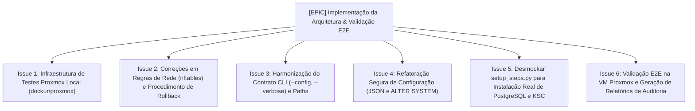

# Plano Executivo de Arquitetura e Validação E2E

**Data:** 2026-09-11
**Projeto:** `portosoft/ksc-deployment-runbook`
**Objetivo:** Estruturar e rastrear a remediação das fragilidades arquiteturais identificadas na revisão e a validação ponta a ponta na VM Proxmox local.

---

## 🎯 Visão Geral do Plano

O projeto evolui de uma coleção de scripts para um produto operacional confiável através de 4 pilares:
1. **Infraestrutura e Testes Locais:** Setup reproduzível via `dockur/proxmox` em Podman rootless, eliminando testes cegos.
2. **Correção de Débitos Críticos:** Regras nftables em `docs/08-hardening.md`, rollback em `docs/11-rollback.md` e contrato de CLI.
3. **Refatoração de Código e Desmockagem:** Substituição de `sed` por JSON nativo e queries SQL, implementação do deploy real em `setup_steps.py`.
4. **Validação E2E e Evidências:** Ciclo de deploy real em VM Rocky Linux 9 com geração de relatórios auditáveis.

---

## 🗺️ Frentes de Trabalho e Mapeamento de Issues

---

## 📋 Detalhamento das Etapas

### Etapa 1: Infraestrutura de Testes Proxmox Local
- **Artefatos:** `infra/proxmox/compose.yml`, `infra/proxmox/README.md`, `docs/14-ambiente-testes-proxmox.md`.
- **Escopo:** Sobe container Proxmox VE 9.x com Podman rootless (`/dev/kvm`), com sidecars `socat` redirecionando portas do host para a VM de testes (`172.30.5.10`):
  - `2222 -> 22` (SSH)
  - `8443 -> 443` (Web Console HTTPS)
  - `8080 -> 8080` (Web Console HTTP)
  - `13291 -> 13291` (Administration Server API)
  - `13000 -> 13000` (NetAgent SSL)
  - `14000 -> 14000` (NetAgent Plain)
  - `5432 -> 5432` (PostgreSQL 16)

### Etapa 2: Correções em Documentação e Segurança
- **Artefatos:** `docs/08-hardening.md`, `docs/11-rollback.md`.
- **Escopo:**
  - Corrigir regras de firewall nftables em `docs/08-hardening.md` (portas 13291, 443, 8080, 13000, 14000 em vez das portas erradas 1329 e 3000).
  - Atualizar o procedimento em `docs/11-rollback.md` antes de incluir `DROP DATABASE ksciam;`, documentando a sequência segura: 1) interromper os serviços que utilizam o PostgreSQL (`klnagent_srv`, `kladminserver_srv`, console web), 2) conectar-se à base administrativa `postgres`, 3) encerrar conexões restantes com `ksciam` via `pg_terminate_backend`, 4) executar a remoção do banco (`DROP DATABASE ksciam;`, usando `IF EXISTS` para idempotência e restringindo `WITH (FORCE)` ao ambiente de testes com salvaguarda explícita), 5) e só então remover o usuário padronizado (`kluser`/`ksc_admin`).

### Etapa 3: Harmonização de CLI e Paths Dinâmicos
- **Artefatos:** `automation/python/kscctl.py`, `automation/python/config.py`, `automation/lib/vault.py`.
- **Escopo:**
  - Adicionar suporte a `--config <caminho>` e `--verbose` em `kscctl.py`.
  - Permitir resolução dinâmica de caminhos de arquivos `.env` e segredos em `config.py` e `vault.py`, permitindo execução a partir de qualquer subdiretório.

### Etapa 4: Refatoração Segura de Configuração (Ops)
- **Artefatos:** `automation/ops/fix_web_console_config.py`, `automation/ops/ksc_harden_db.py`.
- **Escopo:**
  - Substituir comandos regex `sed -i` por parsing e serialização JSON estruturados via módulo `json` do Python em `fix_web_console_config.py`.
  - Configurar PostgreSQL via `ALTER SYSTEM SET max_connections = 1000;` e `ALTER SYSTEM SET shared_preload_libraries = 'pg_stat_statements';` em `ksc_harden_db.py`, documentando e aplicando o reinício obrigatório via `systemctl restart postgresql-16` (pois são parâmetros de contexto *postmaster* que exigem restart e não são aplicados por `pg_reload_conf()`), validar `pg_settings.pending_restart` como falso confirmando os valores em runtime e executar `CREATE EXTENSION IF NOT EXISTS pg_stat_statements;` no banco-alvo.

### Etapa 5: Desmockagem do Setup
- **Artefatos:** `automation/python/setup_steps.py`, `automation/python/ksc_setup.py`.
- **Escopo:**
  - Conectar as rotinas de provisionamento do PostgreSQL e geração do arquivo de respostas `ksc_response.txt` dinâmico com a chamada ao instalador silencioso do KSC (`setup/postinstall.pl` ou RPM).
  - Implementar verificação de retorno de erro e restauração segura do SELinux no bloco `finally:`.

### Etapa 6: Validação Ponta a Ponta (E2E) e Critérios de Aceite
- **Escopo:**
  - Executar na VM Rocky Linux 9:
    1. `python3 -m automation.python.kscctl audit --check` -> Retorno 0 (sem falhas críticas).
    2. `python3 -m automation.python.kscctl setup --apply` -> Instalação concluída com sucesso.
    3. `python3 -m automation.python.kscctl audit --postcheck` -> Serviços e checks ativos (`postgresql`/`postgresql-16`, `klnagent_srv`, `kladminserver_srv`, query `db_query` e porta do Web Console em LISTEN).
    4. `python3 -m automation.python.kscctl audit --report` -> Relatório PDF gerado em `evidence/reports/<timestamp>/report.pdf` (validando a existência física do arquivo `.pdf`, além do retorno 0 da execução).
  - Validação externa pelo navegador em `https://127.0.0.1:8443`.
