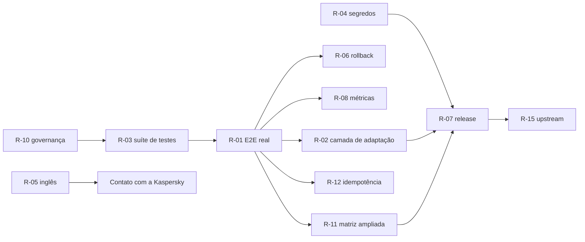

# 9. Backlog canônico e plano de evolução

> **Este documento é a única fonte da verdade do desenvolvimento do projeto.**
> Nenhum outro arquivo define trabalho a ser feito. Ver §0.

---

## 0. Consolidação do caminho de desenvolvimento

### 0.1 Problema identificado

O projeto acumulou **oito trilhas paralelas de planejamento**, produzidas em
momentos diferentes por pessoas e agentes diferentes. Elas se sobrepõem, se
contradizem parcialmente e geram retrabalho — o caso mais evidente foi o ciclo
de 66 pull requests automatizadas tentando corrigir repetidamente os mesmos
dois problemas.

| Trilha | Natureza | Destino |
|---|---|---|
| `docs/internal/PLANO-EXECUCAO-ARQUITETURA.md` | Plano de 6 issues de arquitetura e E2E | **Absorvido** neste documento; o arquivo passa a ser registro histórico |
| `docs/internal/PLANO-RESOLUCAO-85-PRS.md` | Saneamento de PRs abertas | **Absorvido** como R-10; arquivo vira registro histórico |
| `docs/internal/review-remediation-v2.md` | Remediações já aplicadas do review do PR #72 | **Encerrado** — registro do que foi feito, não backlog |
| `docs/internal/DIAGNOSTICO.md` | Diagnóstico executivo | **Encerrado** — insumo histórico |
| `docs/internal/SESSION-*.md` | Notas de sessão | **Encerrado** — registro histórico |
| `.kiro/specs/credential-sanitization/` | Spec de sanitização de credenciais | **Concluída** — tarefas marcadas como feitas; nenhum item pendente migra |
| `CHECKLIST.md` | Checklist operacional do deploy | **Mantido**, mas com escopo restrito ao operador — não é backlog de engenharia |
| `.agents/AGENTS.md`, `.jules/sentinel.md`, `AGENTS.md` | Instruções a agentes automatizados | **Unificados** em `AGENTS.md` na raiz (R-10) |

### 0.2 Regras de governança adotadas

Para impedir a reabertura de caminhos paralelos:

1. **Um único backlog.** Todo trabalho futuro nasce como item `R-nn` neste
   documento e como issue correspondente no GitHub. Um documento de plano novo
   em `docs/internal/` não cria trabalho válido.
2. **Um único fluxo de branches.** `feature/*` → `develop` → `main`. Nenhum PR
   de correção é aberto contra `main` — foi a causa-raiz das 66 PRs duplicadas.
3. **Um único dono por item.** Cada `R-nn` tem um responsável; dois itens não
   podem tocar a mesma superfície simultaneamente.
4. **Agentes automatizados sob rédea curta.** Os workflows `trigger-bot-pr`,
   `recreate-prs` e `pr-agent`, e o Sentinel/Jules, ficam **desabilitados** até
   que R-10 defina um único agente com escopo e branch alvo explícitos. Um
   agente que abre PRs repetidas para o mesmo problema é tratado como defeito,
   não como contribuição.
5. **Pré-requisito de ordem.** R-01 bloqueia qualquer afirmação de
   compatibilidade e qualquer promoção de maturidade. Nenhum item de médio ou
   longo prazo inicia antes de R-01 e R-03 concluídos.
6. **Registro histórico é imutável.** Documentos marcados como "encerrado"
   acima não devem ser editados nem usados como referência de trabalho
   pendente; se algo neles ainda importa, vira `R-nn` aqui.

---

## 1. Curto prazo — fechar a lacuna de validação

*Pré-condição para qualquer avanço de maturidade.*

| ID | Item | Objetivo | Valor | Dependências | Esforço | Risco | Critério de conclusão |
|---|---|---|---|---|---|---|---|
| **R-01** | Desmockar `setup_steps.py` e executar o ciclo E2E no laboratório Proxmox | Substituir os 4 mocks por implementação real e provar o deploy | Remove L-01, L-02 e L-03 de uma vez | `infra/proxmox/` operante; RPMs oficiais | Alto | Alto — pode revelar incompatibilidades | Deploy completo em Rocky Linux 9 com Web Console acessível em HTTPS/443 e relatório de auditoria com zero falhas críticas, com log real anexado |
| **R-02** | Isolar as dependências frágeis atrás de uma camada de adaptação por versão | Concentrar `config.json`, `web-server.js` e `postinstall.pl` em um único módulo, com verificação de esquema e falha explícita | Torna a quebra detectável em vez de silenciosa | Respostas Q1–Q3 (desejáveis, não bloqueantes) | Médio | Médio | Nenhum acesso a arquivo interno do KSC fora do módulo de adaptação; teste que falha ao detectar esquema desconhecido |
| **R-03** | Sanear a suíte de testes | Mover `automation/ops/test_sudo.py` e `automation/smoke-tests/test_api_login.py` para fora da coleta padrão; publicar cobertura no CI | Elimina L-13; dá sinal confiável de qualidade | Nenhuma | Baixo | Baixo | `pytest -q` sem erros de coleta e percentual de cobertura visível no CI |
| **R-04** | Endurecer o manuseio de segredos e privilégios | Vault como padrão; sanitização de segredos no log; auditoria da política de host key SSH; documentar `sudo` mínimo | Fecha L-07, L-08 e a lacuna de §4.3 | Resposta Q6 (desejável) | Médio | Médio | `.env` em texto claro sinalizado como modo degradado; teste que prova ausência de segredos nos logs de evidência |
| **R-05** | Versão em inglês da proposta e do README | Viabilizar revisão pela equipe internacional | Fecha L-10 | Nenhuma | Baixo | Baixo | `00-executive-summary`, `03-integration` e `README` disponíveis em inglês |
| **R-06** | Rollback verificado | Exercitar o procedimento sobre uma instalação parcial; automatizar se Q4 confirmar segurança | Fecha L-06 | R-01; resposta Q4 | Médio | Médio | Rollback executado com estado final verificado e reinstalação limpa bem-sucedida na sequência |

## 2. Médio prazo — sustentabilidade

| ID | Item | Objetivo | Valor | Dependências | Esforço | Risco | Critério de conclusão |
|---|---|---|---|---|---|---|---|
| **R-07** | Processo de release | Tag SemVer, changelog por release, artefato assinado, versão do KSC suportada declarada | Fecha L-11 e parte de L-15 | R-01, R-03 | Médio | Baixo | `v0.1.0` publicada com assinatura e matriz de compatibilidade comprovada |
| **R-08** | Medição | Tempo total, consumo de recursos e taxa de sucesso do deploy, em duas execuções consecutivas | Substitui hipóteses por números; habilita qualquer comparação | R-01 | Baixo | Baixo | Métricas publicadas com ambiente, versão e método declarados |
| **R-09** | Decidir o futuro da pilha Ansible | Manter como interface fina sobre o núcleo Python, ou descontinuar | Fecha L-12 | R-01 | Médio | Médio | Decisão registrada como ADR e um único caminho de execução em operação |
| **R-10** | Governança de automação e saneamento de PRs | Fechar PRs duplicadas, unificar `AGENTS.md`, definir um único agente com branch alvo `develop` | Elimina a causa-raiz do retrabalho | Nenhuma | Médio | Baixo | Zero PRs duplicadas abertas; um único arquivo de instruções de agente; workflows redundantes removidos ou desabilitados |
| **R-11** | Validação em Oracle Linux 9 e em uma segunda versão menor do KSC 16.x | Ampliar a matriz comprovada | Converte compatibilidade inferida em testada | R-01 | Médio | Médio | Segunda e terceira linhas da tabela de §3.5 com resultado real |
| **R-12** | Idempotência verificada | Segunda execução sobre servidor já implantado sem efeito destrutivo | Requisito para uso em frota | R-01 | Médio | Médio | Reexecução com zero alterações inesperadas, comprovada por diff de auditoria |

## 3. Longo prazo — condicionado a interesse da Kaspersky

| ID | Item | Objetivo | Dependências | Condição |
|---|---|---|---|---|
| **R-13** | Migrar automação pós-instalação para interface programática oficial | Eliminar dependência de arquivos internos | Resposta Q5 | Somente se houver interface recomendada |
| **R-14** | Suporte a múltiplos servidores e cenários de alta disponibilidade | Ampliar escopo além de servidor único | R-12 | Demanda real de usuários |
| **R-15** | Contribuição upstream — casos de falha, melhorias de documentação, sugestões ao instalador | Devolver valor à ferramenta principal | R-01, Q1–Q7 | Interesse manifesto da equipe |
| **R-16** | Sustentabilidade do projeto: mais de um mantenedor, política de suporte, cadência de release | Reduzir risco de projeto de um único autor | R-07 | Adoção comprovada |

## 4. Sequenciamento

R-05 e R-10 podem começar imediatamente e em paralelo; todo o restante segue a
ordem acima. Nenhum item fora deste grafo deve ser iniciado.
