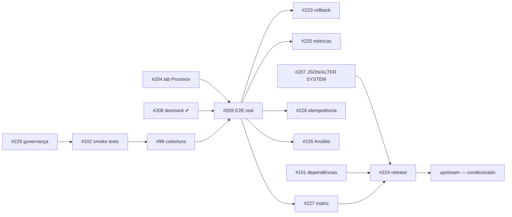

# 9. Backlog e plano de evolução

> **A fonte da verdade do desenvolvimento é o GitHub**, não este arquivo:
>
> - Board: <https://github.com/orgs/portosoft/projects/1>
> - Issues: <https://github.com/portosoft/ksc-deployment-runbook/issues>
> - Épico corrente: [#203](https://github.com/portosoft/ksc-deployment-runbook/issues/203)
>
> Este documento é uma **visão** desse backlog para o leitor externo. Se ele
> divergir do board, o board vence. Ver §0.

---

## 0. Consolidação do caminho de desenvolvimento

### 0.1 Problema identificado

O projeto acumulou trilhas paralelas de planejamento, produzidas em momentos
diferentes por pessoas e agentes diferentes. Elas se sobrepõem, se contradizem
parcialmente e geram retrabalho — o caso mais evidente foi o ciclo de 66 pull
requests automatizadas tentando corrigir repetidamente os mesmos dois
problemas.

Este próprio documento chegou a reproduzir o problema: sua primeira versão
criou uma numeração `R-nn` paralela às issues que já existiam no GitHub. A
correção está aplicada — todo item abaixo referencia a issue real.

| Trilha | Natureza | Destino |
|---|---|---|
| Board do GitHub + issues | Backlog vivo | **Fonte única da verdade** |
| `docs/internal/PLANO-EXECUCAO-ARQUITETURA.md` | Plano de 6 issues de arquitetura e E2E | **Absorvido** pelas issues [#204](https://github.com/portosoft/ksc-deployment-runbook/issues/204)–[#209](https://github.com/portosoft/ksc-deployment-runbook/issues/209); arquivo vira registro histórico |
| `docs/internal/PLANO-RESOLUCAO-85-PRS.md` | Saneamento de PRs abertas | **Absorvido** pela issue [#229](https://github.com/portosoft/ksc-deployment-runbook/issues/229) |
| `docs/internal/review-remediation-v2.md` | Remediações já aplicadas do review do PR #72 | **Encerrado** — registro do que foi feito |
| `docs/internal/DIAGNOSTICO.md` | Diagnóstico executivo | **Encerrado** — insumo histórico |
| `docs/internal/SESSION-*.md` | Notas de sessão | **Encerrado** — registro histórico |
| `.kiro/specs/credential-sanitization/` | Spec de sanitização de credenciais | **Concluída** — nenhum item pendente migra |
| `CHECKLIST.md` | Checklist operacional do deploy | **Mantido**, restrito ao operador — não é backlog de engenharia |
| `.agents/AGENTS.md`, `.jules/sentinel.md`, `AGENTS.md` | Instruções a agentes automatizados | **A unificar** — issue [#229](https://github.com/portosoft/ksc-deployment-runbook/issues/229) |

### 0.2 Regras de governança adotadas

1. **Um único backlog: o board.** Todo trabalho nasce como issue no GitHub e
   entra no board. Um documento de plano em `docs/internal/` não cria trabalho
   válido, e este arquivo não numera itens por conta própria.
2. **Um único fluxo de branches.** `feature/*` → `develop` → `main`. Nenhum PR
   de correção contra `main` — foi a causa-raiz das 66 PRs duplicadas.
3. **Um único dono por issue.** Duas issues não tocam a mesma superfície
   simultaneamente.
4. **Agentes automatizados sob rédea curta.** Escopo e branch alvo explícitos,
   conforme [#229](https://github.com/portosoft/ksc-deployment-runbook/issues/229).
5. **Pré-requisito de ordem.** [#209](https://github.com/portosoft/ksc-deployment-runbook/issues/209)
   bloqueia qualquer afirmação de compatibilidade e qualquer promoção de
   maturidade.
6. **Registro histórico é imutável.** Documentos marcados como "encerrado" não
   devem ser editados nem usados como referência de trabalho pendente; se algo
   neles ainda importa, vira issue.

---

## 1. Curto prazo — fechar a lacuna de validação

*Pré-condição para qualquer avanço de maturidade.*

| Issue | Item | Estado | Valor | Dependências | Risco |
|---|---|---|---|---|---|
| [#208](https://github.com/portosoft/ksc-deployment-runbook/issues/208) | Desmockar `setup_steps.py` | **Implementado** (PR [#222](https://github.com/portosoft/ksc-deployment-runbook/pull/222)); aguarda o critério de aceite em host real | Reclassifica L-01 | — | Médio |
| [#209](https://github.com/portosoft/ksc-deployment-runbook/issues/209) | Validação E2E na VM Proxmox com geração de evidências | Pendente — **item mais importante do projeto** | Fecha L-02 e L-03 | #204, #208 | Alto — pode revelar incompatibilidades |
| [#207](https://github.com/portosoft/ksc-deployment-runbook/issues/207) | Substituir `sed` por JSON nativo e `ALTER SYSTEM` | Parcialmente aplicado | Reduz a fragilidade de L-04 | — | Médio |
| [#99](https://github.com/portosoft/ksc-deployment-runbook/issues/99) | Ampliar cobertura de testes de ops e runtime | Em andamento — `setup_steps.py` coberto pelo PR #222 | Sinal confiável de qualidade | — | Baixo |
| [#102](https://github.com/portosoft/ksc-deployment-runbook/issues/102) | Formalizar smoke tests fora do fluxo padrão | Pendente — causa os 2 erros de coleta do pytest | Elimina L-13 | — | Baixo |
| [#101](https://github.com/portosoft/ksc-deployment-runbook/issues/101) | Sanear dependências e baseline de segredos | Pendente | Parte de L-07 e L-08 | — | Médio |
| [#205](https://github.com/portosoft/ksc-deployment-runbook/issues/205) | Corrigir regras nftables e procedimento de rollback | Pendente | Reduz risco operacional | — | Médio |
| [#206](https://github.com/portosoft/ksc-deployment-runbook/issues/206) | Harmonizar contrato CLI (`--config`, `--verbose`) e paths | Pendente | Usabilidade e execução fora da raiz | — | Baixo |
| [#103](https://github.com/portosoft/ksc-deployment-runbook/issues/103) | Documentação final e critério de prontidão externa | Em andamento — este pacote de revisão | Fecha parte de L-10 | — | Baixo |
| [#229](https://github.com/portosoft/ksc-deployment-runbook/issues/229) | Um único caminho de desenvolvimento e contenção dos agentes | Pendente — pode começar imediatamente | Elimina a causa-raiz do retrabalho | — | Baixo |

## 2. Médio prazo — sustentabilidade

| Issue | Item | Dependências | Critério de conclusão |
|---|---|---|---|
| [#223](https://github.com/portosoft/ksc-deployment-runbook/issues/223) | Rollback verificado sobre instalação parcial | #209 | Rollback exercitado e reinstalação limpa na sequência |
| [#224](https://github.com/portosoft/ksc-deployment-runbook/issues/224) | Processo de release com SemVer e artefato assinado | #209, #99 | `v0.1.0` assinada, com matriz baseada em execução real |
| [#225](https://github.com/portosoft/ksc-deployment-runbook/issues/225) | Medição de tempo, recursos e taxa de sucesso | #209 | Métricas publicadas com ambiente e método declarados |
| [#226](https://github.com/portosoft/ksc-deployment-runbook/issues/226) | Decidir o futuro da pilha Ansible | #209 | ADR registrado e um único caminho de execução |
| [#227](https://github.com/portosoft/ksc-deployment-runbook/issues/227) | Matriz ampliada: Oracle Linux 9 e segunda versão do KSC 16.x | #209 | Três linhas da tabela §3.5 com resultado real |
| [#228](https://github.com/portosoft/ksc-deployment-runbook/issues/228) | Idempotência verificada do setup | #209 | Segunda execução sem alterações inesperadas |

## 3. Longo prazo — condicionado a interesse da Kaspersky

Ainda sem issue: só são abertas se a condição se confirmar, para não inflar o
board com trabalho especulativo.

| Item | Dependências | Condição |
|---|---|---|
| Migrar automação pós-instalação para interface programática oficial | Resposta [Q5](08-maintainer-questions.md) | Somente se houver interface recomendada |
| Suporte a múltiplos servidores e alta disponibilidade | #228 | Demanda real de usuários |
| Contribuição upstream — casos de falha, documentação, sugestões ao instalador | #209, Q1–Q7 | Interesse manifesto da equipe |
| Sustentabilidade: mais de um mantenedor, política de suporte, cadência de release | #224 | Adoção comprovada |
| Tradução do pacote de revisão para inglês | — | Antes do contato com a equipe internacional |

## 4. Sequenciamento

## 5. Questões de governança ainda abertas

| Questão | Encaminhamento proposto |
|---|---|
| A issue [#97](https://github.com/portosoft/ksc-deployment-runbook/issues/97) `[META] Roadmap de prontidão` e o épico [#203](https://github.com/portosoft/ksc-deployment-runbook/issues/203) descrevem o mesmo papel | Manter apenas o #203 como épico corrente; encerrar o #97 referenciando-o, ou subordiná-lo explicitamente |
| As issues #223–#228 não estão vinculadas a um épico | Referenciá-las no #203, ou criar um segundo épico de sustentabilidade após o #209 |
